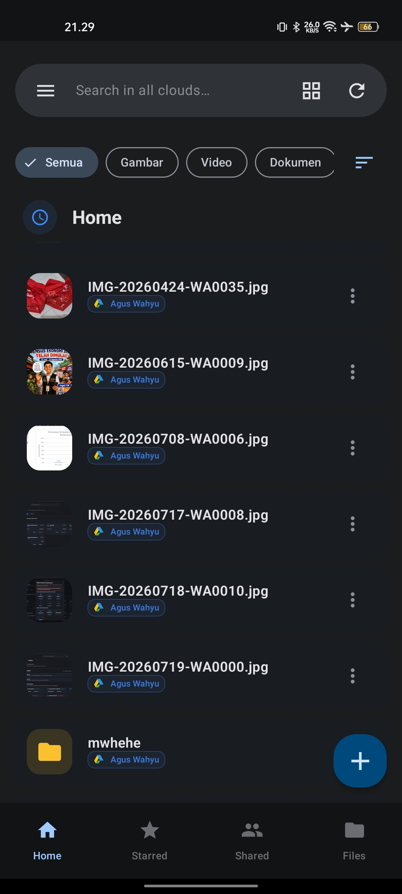
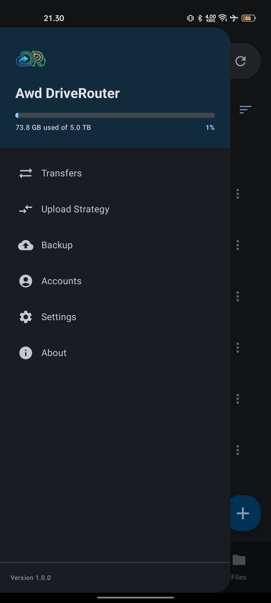
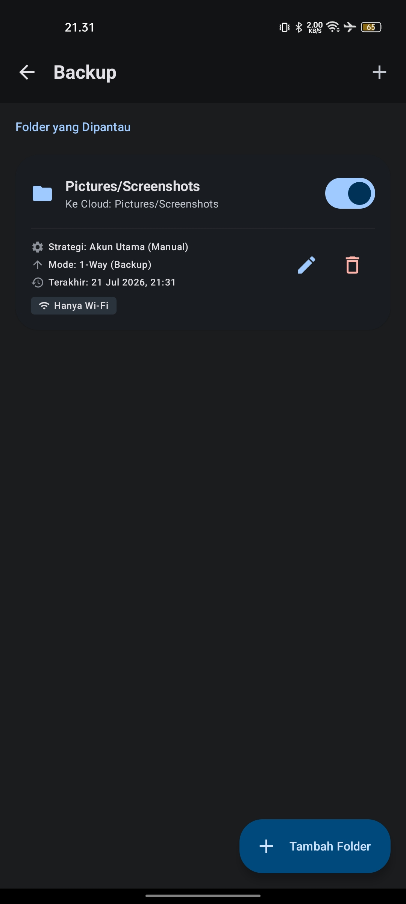
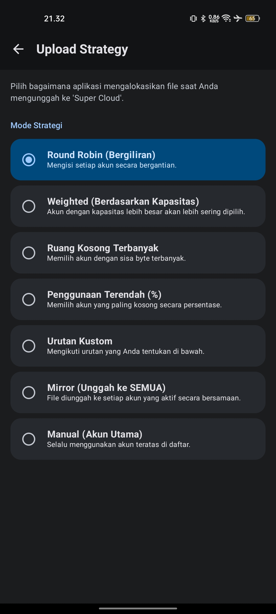
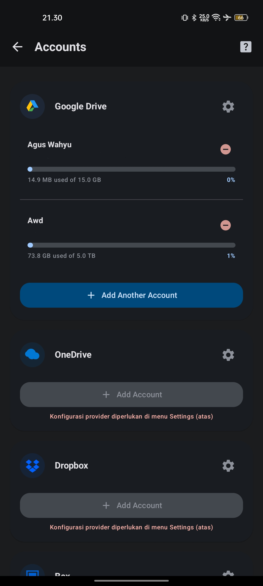
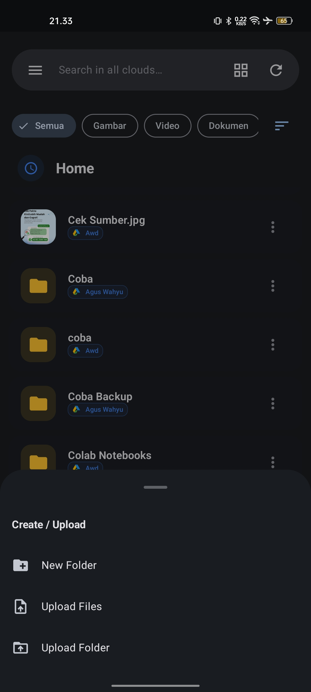

# Awd DriveRouter Android 📱☁️🔀

<p align="center">
  
</p>

<p align="center">
  <a href="https://github.com/putuwahyu29/awd-driverouter-android/blob/main/LICENSE">
    
  </a>
  
  
  
  
</p>

**Awd DriveRouter Android** adalah aplikasi manajemen file seluler canggih yang dirancang untuk menghubungkan berbagai layanan penyimpanan cloud ke dalam satu pengalaman yang terpadu. Dibangun dengan **Kotlin** dan **Jetpack Compose**, aplikasi ini menyediakan lapisan perutean cerdas untuk file Anda, mendukung penjelajahan yang lancar, manajemen multi-akun, dan sinkronisasi latar belakang di berbagai penyedia termasuk Google Drive, OneDrive, Dropbox, Box, WebDAV, dan SFTP.

---

## 🌐 Bahasa / Language
*   [Versi Bahasa Indonesia](README.id.md)
*   [English Version](README.md)

---

## 📌 Daftar Isi
- [✨ Fitur Utama](#-fitur-utama)
- [📷 Tangkapan Layar](#-screenshots)
- [☁️ Provider yang Didukung & Panduan Setup](#️-provider-yang-didukung--panduan-setup)
- [📁 Arsitektur & Teknologi](#-arsitektur--teknologi)
- [🚀 Memulai](#-memulai)
- [🛠️ Panduan Pengembang](#️-panduan-pengembang)
- [⚙️ Troubleshooting](#️-troubleshooting)
- [⚠️ Disclaimer](#️-disclaimer)
- [📄 Lisensi](#-lisensi)

---

## ✨ Fitur Utama

*   **🔀 Manajemen Cloud Terpadu**: Hubungkan dan navigasi berbagai akun cloud (Google Drive, OneDrive, Dropbox, Box, WebDAV, SFTP) dari satu antarmuka yang intuitif.
*   **📤 Perutean Cerdas**: Distribusikan unggahan secara otomatis di seluruh provider berdasarkan strategi cerdas seperti "Ruang Kosong Terbanyak" atau "Round Robin".
*   **📂 Explorer File Profesional**: Manajer file lengkap dengan fitur multi-seleksi, aksi batch, pratinjau PDF internal, dan integrasi aplikasi native.
*   **🔄 Cadangan Otomatis Latar Belakang**: Sinkronisasi folder otomatis di latar belakang menggunakan **Android Foreground Services**.
*   **🔒 Penyimpanan Kredensial Aman**: Menggunakan **EncryptedSharedPreferences** Android untuk menyimpan token OAuth dan kredensial server dengan aman.
*   **🎨 Desain Material 3**: UI yang sepenuhnya responsif dengan dukungan Dynamic Color, mode Gelap/Terang, dan dukungan bilingual (EN/ID).

---

## 📷 Tangkapan Layar

| Pengelola File Beranda | Menu Navigasi | Cadangan Otomatis |
|:---:|:---:|:---:|
| <br/>**Pengelola File Beranda** | <br/>**Menu Navigasi** | <br/>**Cadangan Otomatis** |

| Strategi Unggah | Akun Cloud | Unggah File |
|:---:|:---:|:---:|
| <br/>**Strategi Unggah** | <br/>**Akun Cloud** | <br/>**Unggah File** |

---

## ☁️ Provider yang Didukung & Panduan Setup

Di aplikasi Android, buka **Pengaturan → Pengaturan Provider Cloud** untuk melihat detail identitas aplikasi Anda (**Nama Paket**, **SHA-1 (HEX)**, **SHA-1 (Base64)**, dan **Redirect URI**) lengkap dengan tombol salin 1-klik.

| Provider | Tipe | Link Konsol Provider | Panduan Setup & Alur Kredensial |
| :--- | :---: | :--- | :--- |
| **Google Drive** | OAuth 2.0 | [Google Cloud Console](https://console.cloud.google.com/) | **1.** Buat **OAuth Client ID #1 (Web application)** -> Salin Client ID ke Pengaturan Aplikasi.<br/>**2.** Buat **OAuth Client ID #2 (Android)** -> Daftarkan **Nama Paket** & **SHA-1 (HEX)** dari Pengaturan Aplikasi. |
| **OneDrive** | OAuth 2.0 | [Microsoft Entra](https://entra.microsoft.com/) | **1.** Daftarkan Aplikasi di Entra admin center.<br/>**2.** Pada menu *Authentication*, tambahkan **Platform Android** dengan **Nama Paket** & Signature Hash **SHA-1 (Base64)**.<br/>**3.** Salin **Application (client) ID** ke Pengaturan Aplikasi. |
| **Dropbox** | OAuth 2.0 | [Dropbox Console](https://www.dropbox.com/developers/apps) | **1.** Buat aplikasi dengan Scoped Access (`files.content.read/write`).<br/>**2.** Daftarkan Redirect URI: `awd-driverouter://dropbox-auth`<br/>**3.** Salin **App Key** ke Pengaturan Aplikasi. |
| **Box** | OAuth 2.0 | [Box Console](https://app.box.com/developers/console) | **1.** Buat Custom App (User Authentication OAuth 2.0).<br/>**2.** Daftarkan Redirect URI: `awd-driverouter://box-auth`<br/>**3.** Salin **Client ID** & **Client Secret** ke Pengaturan Aplikasi. |
| **WebDAV** | Protokol | - | Koneksi langsung. Masukkan **URL Server**, **Username**, dan **Password** langsung di dialog *Connect Account*. |
| **SFTP (SSH)** | Protokol | - | Koneksi langsung. Masukkan **Host/IP**, **Port** (default 22), **Username**, dan **Password** di dialog *Connect Account*. |

---

## 📁 Arsitektur & Teknologi

*   **UI**: Jetpack Compose (Material 3)
*   **Asinkron**: Kotlin Coroutines & Flow
*   **Dependency Injection**: Hilt
*   **Database Lokal**: Room (Caching metadata & akun)
*   **Keamanan**: EncryptedSharedPreferences (MasterKey)
*   **Networking**: Retrofit, OkHttp, Sardine (WebDAV), SSHJ (SFTP)
*   **Arsitektur**: MVVM dengan prinsip Clean Architecture

---

## 🚀 Memulai

### Prasyarat
*   Perangkat Android yang menjalankan Android 8.0 (API 26) atau lebih tinggi.
*   Kredensial API provider cloud (untuk Google, OneDrive, Dropbox, atau Box).

### Instalasi
1. Unduh APK terbaru dari halaman [Releases](https://github.com/putuwahyu29/awd-driverouter-android/releases).
2. Instal APK di perangkat Anda (pastikan "Instal dari Sumber Tidak Dikenal" diaktifkan).

---

## 🛠️ Panduan Pengembang

### Struktur Proyek
```
awd-driverouter-android/
├── app/                    # Modul aplikasi Android utama
│   ├── src/main/java/com/awd/driverouter/
│   │   ├── data/           # Implementasi Repository, DAO, dan Provider
│   │   ├── di/             # Modul Hilt
│   │   ├── domain/         # Model bisnis dan interface provider
│   │   ├── ui/             # Layar dan viewmodel Jetpack Compose
│   │   └── util/           # Utilitas pemformatan dan pembantu
│   └── build.gradle.kts    # Dependensi modul
├── docs/screenshots/       # Gambar tangkapan layar untuk dokumentasi
├── gradle/                 # Gradle wrapper
└── README.md               # Dokumentasi Bahasa Inggris
```

### Membangun dari Sumber
1. Klon repositori:
   ```bash
   git clone https://github.com/putuwahyu29/awd-driverouter-android.git
   ```
2. Buka di Android Studio (Iguana atau yang lebih baru).
3. Bangun proyek:
   ```bash
   ./gradlew assembleDebug
   ```

---

## ⚙️ Troubleshooting

*   **Masalah Callback OAuth**: Pastikan URI pengalihan skema kustom (`awd-driverouter://dropbox-auth` atau `awd-driverouter://box-auth`) terdaftar di konsol provider Anda.
*   **Kesalahan Google Drive Error 10**: Pastikan fingerprint SHA-1 (HEX) dan Nama Paket di Google Cloud Console persis sama dengan tanda tangan APK Anda.
*   **Kesalahan OneDrive MSAL**: Pastikan Nama Paket dan Signature Hash SHA-1 (Base64) di Microsoft Entra cocok dengan build aplikasi Anda.

---

## ⚠️ Disclaimer

Proyek ini adalah pengembangan open-source independen. Tidak didukung secara resmi oleh Google, Microsoft, Dropbox, Box, atau penyedia layanan lain yang disebutkan. Pengguna bertanggung jawab untuk memastikan kepatuhan terhadap Ketentuan Layanan masing-masing provider.

---

## 📄 Lisensi

Proyek ini dilisensikan di bawah Lisensi MIT. Lihat file [LICENSE](LICENSE) untuk detailnya.

---

<p align="center">Dibuat dengan ❤️ oleh <a href="mailto:aguswahyu@office.awd.my.id">I Putu Agus Wahyu Dupayana</a></p>
